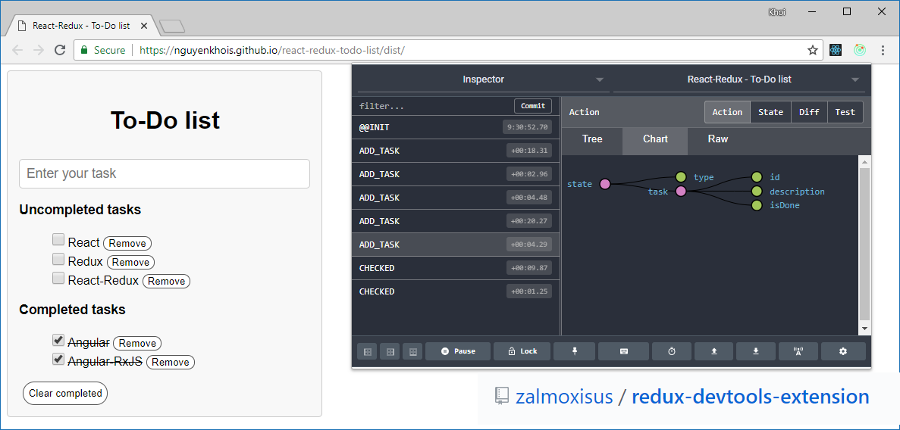

# React-Redux - To-Do list
## How you view
You should view step by step if you want to know about React-Redux:
 * Step 0 (`index.js`): Data structures
 * Step 1 (`reducer.js`): Creating reducer
 * Step 2 (`index.js`): Creating store after you have created reducer
 * Step 3 (`actions.js`): Creating actions (Redux dispatchs)
 * Step 4 (`todos.components.js`)
    * Step 4a: Mapping Redux dispatchs to React props by using mapDispatchToProps()
    * Step 4b: Mapping Redux state to React props by using mapStateToProps()
    * Step 4c: Creating React class component. View more on `lists.component.js`
* Step 5 (`todos.components.js`): Creating connection between Redux state and actions (dispatchs) with React class component by using connect()
* Step 6 (`index.js`): Rendering by Provider

## Screenshot
View on [Codesandbox](https://codesandbox.io/s/7m2nzolvv1)

## Compatibility
Build environment is compatible with:
* Windows
* MacOS
* Debian

## Installation
* Run `npm install` to install all needed packages

## Using
* Run `npm start` or `npm run start` to start your local web server at `localhost:9000`
* Run `npm run build` to build your files from `/src` to `/dist` directory

## Other repositories

You may want to view my other To-Do list examples to know more about Redux and compare what are differences:

* [Redux - Simple To-Do list](https://github.com/nguyenkhois/redux-simple-todo-list)
* [TypeScript - Simple To-Do list](https://github.com/nguyenkhois/typescript-simple-todo-list)
* [React - To-Do list](https://github.com/nguyenkhois/react-todo-list)
* [React-Redux - Simple To-Do list](https://github.com/nguyenkhois/react-redux-simple-todo-list) (It's simpler to understand about React-Redux for beginners)
* [Angular - Simple To-Do list](https://github.com/nguyenkhois/angular-simple-todo-list)
* [Angular-RxJS - To-Do list](https://github.com/nguyenkhois/angular-rxjs-todo-list)